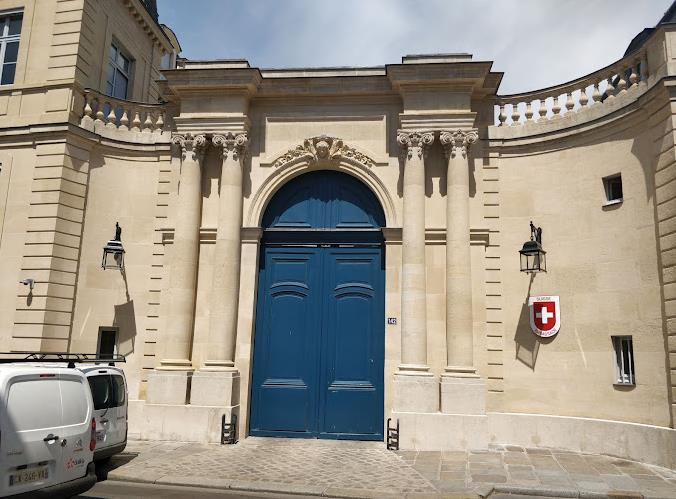

+++
title = "Die bilateralen Beziehungen zwischen der Schweiz und Frankreich: Ein Interview mit der stellvertretenden Missionschefin und Ministerin Nicole Providoli"
date = "2024-01-09"
draft = false
pinned = false
image = "image-000.jpg"
+++

Mitten in Paris, nicht weit vom Eiffelturm entfernt steht die Schweizer Botschaft in Frankreich. Aus der Ferne ist das Gebäude kaum zu erkennen, da es sich von allen anderen Gebäuden nur schwer unterscheiden lässt. Aber mit zunehmender Nähe bemerkt man eine blaue Tür, die einzigartig in der Gegend ist. Rechts neben dieser Tür ist ein Schweizer Logo zu sehen. Diese beiden Merkmale geben uns die Sicherheit, dass wir vor dem richtigen Gebäude stehen.\



Seit 1938 ist das Hôtel de Besenval der Sitz der Schweizer Botschaft in Frankreich. Das Hôtel de Besenval befindet sich in der Rue de Grenelle 142 im 7. Pariser Arrondissement. In der zweiten Hälfte des 18. Jahrhunderts war das Gebäude, das heute als Botschaft und Residenz des Schweizer Botschafters dient, der Wohnsitz von Baron Pierre-Victor de Besenval, einem Kommandeur der Schweizer Garde. Als die Französische Revolution ausbrach, die Besenval vorausgesehen hatte, hatte er das Kommando über die Garnison von Paris. Er hätte den Sturm auf die Bastille am 14. Juli 1789 mit Gewalt abwehren sollen. Doch um einen Bürgerkrieg zu verhindern, traf er die historische Entscheidung, den Schweizer Regimentern den gewaltlosen Rückzug vor der bewaffneten Bevölkerung zu befehlen.\


Das Hôtel der Schweizer Botschaft wurde 1705 für Abbé Chanac de Pompadour erbaut. Im Jahr 1720 ging das Haus nach dem Tod des Abbé de Pompadour an dessen Nichten über und wurde später von verschiedenen französischen Adelsfamilien gekauft, bevor Baron Pierre-Victor de Besenval es 1767 erwarb. Er beauftragte den Architekten Brongniart, einen prachtvollen Speisesaal einzurichten, und liess im Keller ein Nymphäum errichten, dessen kunstvolle Dekoration vom Bildhauer Clodion geschaffen wurde. 

Besenval verstarb 1791 in seinem Hôtel und vermachte es zusammen mit seinem gesamten Eigentum dem Maréchal de Ségur. Im 19. Jahrhundert bewohnten verschiedene Mieter das Hôtel, darunter die Nachkommen von Lucien Bonaparte, dem Bruder Napoleons I., die es zwischen 1855 und 1870 bewohnten. Zwischen 1920 und 1937 diente das Hôtel als Sitz verschiedener internationaler Schiedsgerichte, wie sie in Friedensverträgen vorgesehen waren.

Vor der beeindruckenden Botschaft versammeln wir uns fasziniert von der Pracht des Gebäudes. Doch unser Blick wird schnell auf eine ganz besondere Stelle gelenkt, nämlich die grosse blaue Tür. Das Gebäude ist zu den umliegenden Gebäuden komplementär, jedoch ist die Tür ein Alleinstellungsmerkmal in diesem Gebiet von Paris, was uns dabei geholfen hat, diesen Standort zu lokalisieren. Als die Tür von einem Mitarbeiter der Botschaft geöffnet wird, eröffnet sie uns nicht nur den Zugang zur Botschaft, sondern auch eine aussergewöhnliche Gelegenheit zur Begegnung mit der Ministerin der Schweizer Botschaft in Paris, Frau Nicole Providoli. Mit Frau Providoli dürfen wir ein exklusives Interview führen, in dem grundlegende Fragen zu den bilateralen Beziehungen zwischen der Schweiz und Frankreich diskutiert werden. Das Gespräch vermittelt uns Einblicke in aktuelle Entwicklungen und in wichtige statistische Daten, die die Grundlage dieser bilateralen Beziehungen bilden. Im Folgenden werden die Kernthemen und wertvollen Erkenntnisse aus diesem Gespräch aufgezeigt.

Zu Beginn des Interviews stellt sich die Ministerin unserer Klasse kurz vor. *"Mein Name ist Nicole Providoli",* beginnt sie*, "und als stellvertretende Missionschefin der Schweizer Botschaft in Frankreich trage ich die Verantwortung den Schweizer Botschafter während seiner Abwesenheit zu vertreten. Ich habe einen akademischen Hintergrund in Soziologie und Recht. Dieses Wissen dient mir als solide Grundlage für meine Arbeit als Diplomatin."*

Ihre Ausführungen ergänzt Frau Providoli mit einer beeindruckenden Darstellung von Statistiken, die die hervorragenden Beziehungen zwischen der Schweiz und Frankreich aufzeigen. Diese wertvollen Informationen werden uns auch in Form einer Broschüre präsentiert, die anschauliche Statistiken enthält. Nachfolgend sind einige der bemerkenswertesten statistischen Daten aufgeführt:

* Der französisch-schweizerische Warenhandel beträgt im Jahr 2021 32.7 Milliarden Euro
* Die Schweiz ist das 9. Zielland für französische Exporte und Frankreich ist das 6. Zielland für Schweizer Exporte
* Nach den USA und Deutschland ist die Schweiz der drittgrösste Investor in Frankreich. Andererseits ist Frankreich der viertgrösste Investor in der Schweiz
* Es gibt 1300 Schweizer Unternehmen in Frankreich und 1700 französische Unternehmen in der Schweiz
* CERN, ESRF, ESA, ITER, Eurostars und viele andere sind wichtige Forschungs- und Entwicklungsprogramme mit Beteiligung der beiden Länder

Nach dieser beeindruckenden Darstellung statistischer Daten bietet sich uns die Gelegenheit, Fragen zu den bilateralen Beziehungen zwischen der Schweiz und Frankreich zu stellen. Die wichtigsten Fragen und Antworten seien hier wiedergegeben:

**Sie haben gesagt, dass über 200’000 Grenzgängerinnen und Grenzgänger aus Frankreich in der Schweiz arbeiteten. Glauben Sie, dass die französische Wirtschaft darunter leidet?**

*Nein, im Gegenteil, dies dient beiden Ländern. Qualifizierte französische Grenzgänger, welche in der Schweiz einer Arbeit nachgehen, bringen auch Frankreich Vorteile. Es gibt jedoch schon auch Herausforderungen. Ein Beispiel ist der Gesundheitsbereich, in dem Frankreich unter einem Mangel an Pflegekräften leidet. Es wird auch darüber diskutiert, ob verstärkte Kooperationen auf diesem Gebiet möglich wären.*

**In welchen Bereichen findet derzeit ein verstärkter Austausch zwischen Frankreich und der Schweiz statt?**

*Es gibt viele Bereiche, wo ein Austausch stattfindet. Die Kultur ist einer dieser Bereiche. Künstler, Musiker, Schriftsteller und andere Kreative aus beiden Ländern treten regelmässig in den Kunstgalerien, Konzertsälen und Theatern auf, sowohl in Frankreich als auch in der Schweiz. Dazu ist es bemerkenswert, dass es viele Schweizer Künstler gibt, die in Frankreich leben.*

**Was ist der Hauptgrund, weshalb die Schweiz und Frankreich so eng verbunden sind?**

*Es fliessen viele Faktoren hinein. Die gemeinsame Sprache und die Grenze sind natürlich sehr wichtig. Ein anderer Grund ist, dass viele Schweizer in Frankreich leben (über 200'000) und viele Franzosen in der Schweiz leben (ca. 185’000). Dazu ist der Tourismus zwischen den Ländern stark ausgeprägt.*

**Zu welchen Themen «verhandeln» die beiden Ländern derzeit?**

*Aktuell möchten die Länder Ihre Zusammenarbeit z.B. in den Bereichen der Wirtschaft, Forschung und Innovation, Transport, Energie, etc., fördern und verstärken.*

Nach diesem faszinierenden Gespräch hat die gesamte Klasse die besondere Gelegenheit, die prachtvollen Räume der Botschaft zu erkunden. Im zentralen Raum des Hôtels befindet sich ein beeindruckender Wandteppich, der vom Mobilier National ausgeliehen wurde. Dieser Wandteppich illustriert die Erneuerung des ewigen Friedens zwischen Frankreich und der Schweiz, die am 18. November 1663 in der Kathedrale Notre-Dame de Paris stattfand.

Die Szene zeigt, wie Ludwig XIV. und die Botschafter der Schweizer Kantone einen gegenseitigen Eid auf die Bibel ablegen. Dieser Gobelin-Wandteppich, der nach einer Vorlage von Le Brun gefertigt wurde, ist Teil einer Serie von vierzehn Episoden der Histoire du Roi.

Beim Betreten der Räumlichkeiten werden wir von einer Vielzahl faszinierender Gemälde empfangen, von denen viele Papageien darstellen. Dieser Schwerpunkt lässt sich darauf zurückführen, dass der frühere Besitzer der Botschaft eine besondere Vorliebe für die Natur hatte. Die beeindruckenden Kunstwerke verleihen den Räumen eine lebendige Atmosphäre, was uns allen gefällt.

Das Interview mit Ministerin Nicole Providoli zeigte uns eindrücklich die besonderen Verbindungen zwischen der Schweiz und Frankreich. Von historischen Eidschwüren bis hin zu aktuellen wirtschaftlichen, kulturellen und gesellschaftlichen Austauschen. All dies offenbart die enge Partnerschaft zwischen den beiden Ländern. Die beeindruckende Pracht der Botschaft und die symbolträchtigen Kunstwerke unterstreichen diese Verbindung. Ministerin Providolis Einblicke in die Grenzgänger-Thematik und die Förderung von Kooperationen verdeutlichen, wie die Beziehung beider Länder weiterwächst und sich entwickelt.