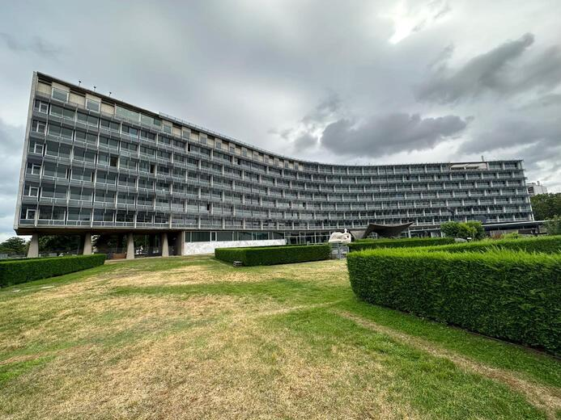
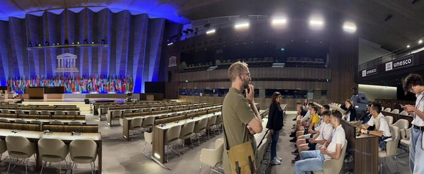

+++
title = "Ein Blick hinter die Kulissen: Der Hauptsitz der UNESCO in Paris  - Ein Ort der internationalen Zusammenarbeit, Kunst und Friedensmission"
date = "2024-01-12"
draft = false
pinned = false
image = "image-000.jpg"
+++
#### Eine Führung durch den UNESCO-Hauptsitz.



Mitten in der französischen Hauptstadt Paris steht das Hauptquartier der UNESCO. Das graue, hinter einem hohen Zaun verborgene Gebäude mag in dieser Grossstadt auf den ersten Blick unscheinbar wirken. Nur die vielen farbigen Fahnen der Mitgliedsstaaten vor dem Bauwerk stechen ins Auge. Trotz dieses unauffälligen Erscheinens befindet sich dort der Hauptsitz einer bedeutsamen internationalen Organisation. Doch was genau passiert in diesem Gebäude und inwiefern hat es mit der Aufklärung zu tun?



Das Wetter ist angenehm sommerlich, als wir die Pariser Metrostation Ségur verlassen und uns auf den kurzen Weg zum UNESCO-Hauptsitz machen. Dieser befindet sich unweit des Eiffelturms im siebten Pariser Arrondissement, gegenüber der École Militaire.

``\
Die UNESCO ist eine internationale Organisation, die im Jahr 1945 gegründet wurde. Seit ihrer Gründung befindet sich ihr Hauptsitz in Paris, der jetzige Sitz wurde jedoch erst 1958 eröffnet. UNESCO ist die Abkürzung für *United Nations Educational, Scientific and Cultural Organization*. Die UNESCO umfasst zahlreiche verschiedene Abteilungen. Dazu gehören die alle zwei Jahre stattfindende Generalversammlung, der Exekutivausschuss und das Sekretariat. Neben zehn Einrichtungen, welche nationale Büros bei spezifischen Programmen assistieren, verfügt die Institution über 65 globale Niederlassungen. Ausserdem zählt die UNESCO zu den 17 rechtlich selbstständigen Sonderorganisationen der Vereinten Nationen und hat 194 Mitgliedsstaaten sowie 12 assoziierte Mitglieder. Ihr Ziel ist, weltweit zum Erhalt von Frieden und Sicherheit beizutragen, indem sie die Zusammenarbeit zwischen Nationen und Völkern in den Bereichen Bildung, Forschung und Kultur fördert. Die universelle Geltung dieser Werte geht unter anderem auf die Aufklärung zurück. Demnach kann die Aufklärung auch als eine Grundlage internationaler Organisationen wie der UNESCO gesehen werden. \
``

Als das Gebäude erstmals in Sichtweite erscheint, lässt sich an der von Beton und Glas geprägten Architektur unschwer feststellen, dass es aus der Nachkriegszeit stammt. In der Tat wurde es 1958 erbaut. Im Aussenbereich befestigen Arbeiter gerade Landesflaggen an den zahlreichen Fahnenmasten. Das Bauwerk selbst symbolisiert allein durch seine Form eine Leitidee der UNESCO. Von der Vogelperspektive aus betrachtet, ähnelt die Form des Gebäudes drei Strängen, die in der Mitte zusammenlaufen. Dies verbildlicht die Wichtigkeit internationaler Zusammenarbeit, auf welcher die UNESCO basiert. Ausserdem beschreibt ein Bericht des “UNESCO Courier” aus dem Jahr 1958 die multinationale Kooperation bei der Entstehung des Gebäudes: 

*„Der internationale Charakter der Anlage wird sofort sichtbar, wenn man sie betritt: Der Fussboden besteht aus norwegischem Quarzit, die Aluminiumpaneele stammen aus Belgien, die Beleuchtungsanlagen wurden in den Vereinigten Staaten hergestellt und auf den in Frankreich gefertigten Glastüren befinden sich Teakholz Fingerplatten aus Birma. Architekten aus Frankreich, Amerika, Italien, Brasilien und Schweden haben die Pläne entworfen und ausgeführt oder sind sich mit Rat und Tat zur Seite gestanden. Industrielle und technologische Fertigkeiten aus vielen Ländern kamen beim Bau zum Einsatz, und als sich die Gebäude in die Pariser Skyline einfügten, waren unter den Arbeitern und Handwerkern auf der Baustelle die Sprachen vieler Nationen zu hören.”*

Nach dem Passieren der Sicherheitskontrolle stellt sich die Tourleiterin, welche viel Expertise über das Gebäude und die UNESCO verfügt, vor. Sie erklärt, dass bei der Erbauung des Gebäudes einfache Materialien wie Beton Verwendung fanden, diese dann aber speziell verarbeitet wurden, um ein besonderes Endprodukt zu erschaffen. Die Fassade des grossen Konferenzraums, welcher im späteren Verlauf der Führung noch betreten wird, ist ein Beispiel für dieses Vorgehen. Im Innenraum des Gebäudes bewegen sich viele Personen in Anzügen und es ist erstaunlicherweise eine grosse Anzahl an Kunstwerken sichtbar: Man könnte fast denken, man befände sich in einem Museum. Am meisten sticht ein grosses, farbiges Wandgemälde heraus, welches den Sturz des Ikarus darstellt. Auf den ersten Blick scheint es gar schon etwas bizarr und beinahe unerklärlich, wie es sich einen Platz im UNESCO-Hauptsitz verdienen konnte, bis die Tourleiterin erläutert, dass das Bild von Picasso sei. Dies war bisher nicht erkenntlich, da sich auf dem Gemälde keine Signatur befindet. Der Grund dafür sei, dass sich das Kunstwerk hinter einer Treppe befindet und man es deshalb nicht uneingeschränkt sehen kann. Dies störte Picasso und er habe sich deshalb geweigert das Werk zu signieren. Ausserdem ist eine Figur mit dem Titel “Walking Man” von Alberto Giacometti ausgestellt.

Anschliessend wird die Tour fortgesetzt und kommt vor dem Eingang zum grossen Konferenzsaal zum Halt. Die Tourleiterin erklärt, was sich darin befinde, und erwähnt, dass dort vor kurzem eine Konferenz stattgefunden habe und der Saal deshalb noch besonders eingerichtet sei. Sie fügt hinzu, dass, obwohl sie schon einige Zeit bei der UNESCO in Paris arbeite, noch nie mit einer Führung den sitzungsbereiten Konferenzraum betreten konnte. Sie überprüft trotzdem, ob die Tür geöffnet ist - mit Erfolg. Die hohen Decken lassen den Saal geräumig und eindrücklich aussehen. Am hinteren Ende der im Rampenlicht beschienen Bühne, befinden sich wieder wie im Aussenbereich alle 193 Fahnen der Mitgliedsländer der UNESCO. Zuerst zögern wir auf einigen der vielen Sessel im Saal Platz zu nehmen, tun es nach Erlaubnis der Tourleiterin jedoch trotzdem.

Der eindrucksvolle Innenbereich ist aber nicht alles, was der UNESCO-Hauptsitz zu bieten hat. Der umfangreiche Aussenbereich, welcher dem Innenraum durch seine vielen Kunstwerke ähnelt, ist mindestens genauso interessant. Insgesamt befinden sich auf dem gesamten Areal 600 Kunstwerke. Es kommt die Frage auf, wie die UNESCO mit Komplikationen, welche die ausgestellte Kunst aufgrund unterschiedlicher Herkunft und Kultur verursachen könnte, umgehe. Darauf antwortet die Tourleiterin, dass es ein Komitee gebe, welches für die Bewertung der Kunstwerke und den Zweck ihrer Ausstellung zuständig sei. Dieses Komitee sei neutral, da seine Mitglieder aus verschieden Ländern stammten.Eines der eindrücklichsten Kunstwerke, inmitten der Westseite des Aussenbereichs, umgeben von unzähligen Landesflaggen, ist eine imposante Weltkugel, welche aus vielen Stäben zusammengesetzt ist. In der Mitte der Sphäre befindet sich eine Metallkugel, die von mehreren Drahtseilen gehalten wird. Das Kunstwerk mit dem Namen „The Symbolic Globe“ verbildlicht die Wichtigkeit der Zusammenarbeit aller Menschen, Kulturen und Ländern auf der Erde, um Frieden zu schaffen. Wenn diese Kooperation aufhört, würde die Kugel nicht gehalten werden und in sich zusammenfallen. Damit zeigt sie die Fragilität der internationalen Gesellschaft und des Weltfriedens auf. Diese Denkweise weist Parallelen zur Aufklärung auf, welche auch die Bedeutung der Vernunft und des Austauschs von Ideen und Kulturen betonte. Jedoch war dieser Austausch zur Zeit der Aufklärung vielfach noch von Rassismus geprägt. Ausnahmen sind diesbezüglich der Seefahrer und Schriftsteller Louis Antoine de Bougainville und der Forschungsreisende Alexander von Humboldt. Texte beider Aufklärer durften wir im Deutschunterricht kennenlernen. 

Von der Sphäre aus blickend ist ein Eingang mit einem imposanten, speziell geformten Betonvordach sichtbar. Der Stil des einzigartigen Eingangs harmoniert wunderbar mit dem gesamten Betongebäude. Die Tourleiterin erklärt, dass dies der offizielle Haupteingang des UNESCO-Hauptsitzes sei und dort schon viele wichtige Staatschefs empfangen wurden.

Als wir unsere Tour fortsetzen und weiter durch den Aussenbereich schlendern, gelangen wir in eine ruhige, grüne Oase, welche sich stark vom Pariser Grossstadttrubel und den Protesten gegen Polizeigewalt unterscheidet.

``\
Unmittelbar vor unserem Aufenthalt in Paris ereigneten sich heftige Proteste. Ursache war die gewaltsame Tötung eines 17-jährigen Jugendlichen durch Polizeikräfte. Die Proteste waren oftmals von Ausschreitungen begleitet und es kam zur Inbrandsetzung von Fahrzeugen, zur Erstürmung und Plünderung von Geschäften und zu anderen Formen der Zerstörung. Die Szenerie erinnerte an Darstellungen aus Kriegsfilmen – eine befremdliche Kulisse, die sich nur unweit des Hauptsitzes der angesehenen Friedensorganisation abspielte. In der Innenstadt waren bis auf manche verbarrikadierten Geschäfte keine signifikanten Spuren der Unruhen sichtbar. \
``

Wir befinden uns in einem japanischen Garten. Ein sanft plätschernder Bach durchzieht den Garten und mündet schließlich in einen kleinen Teich, in dem Fische mit schimmernden Farben schwimmen. Die wahre Einzigartigkeit des Gartens liegt jedoch in einem, auf den ersten Blick unscheinbaren, beschädigten Kopf einer Engelsfigur. Der Kopf hat den verheerenden Atombombenangriff auf Nagasaki in der Endphase des Zweiten Weltkriegs überstanden und wurde von Japan an die UNESCO übergeben. Er stammt von der völlig zerstörten katholischen Urakami-Kathedrale in Nagasaki. Das Unbehagen, das dieses Artefakt hervorruft, kann als Zeichen gegen den Krieg interpretiert werden, was im Einklang mit einer Hauptmission der UNESCO steht.

Die Führung und der Besuch im Hauptsitz der UNESCO ermöglichten einen spannenden Einblick in die Organisation, ihre Geschichte und das Geschehen vor Ort. Insbesondere die Vielfalt der ausgestellten Kunst wird uns in Erinnerung bleiben. Unser Besuch am Hauptsitz erfolgte unmittelbar nach einer für die UNESCO historischen Sitzung: Nachdem die USA die Organisation unter der Trump-Administration verlassen haben, traten sie ihr in der gleichen Woche unseres Besuchs wieder bei. Dies ist hocherfreulich für die UNESCO, da es eine signifikante Erhöhung ihres Budgets bedeutet. Jedoch ist der Hauptgrund für den Wiederbeitritt der USA nicht etwa die uneigennützige Unterstützung der UNESCO und ihrer Werte, sondern vielmehr der wachsende Einfluss Chinas auf die Organisation. 

Die Geschichte erinnert uns daran, dass Fortschritt nicht linear ist. Obwohl die Ideale der Aufklärung, auf denen die UNESCO basiert, einen Weg zu modernen Denkweisen und Weltanschauungen wiesen, wurden diese in der Vergangenheit von Rückschlägen überschattet. Die düsteren Kapitel der Weltkriege und des Nationalsozialismus verdeutlichen, dass es unablässige Anstrengung erfordert, um diese Hindernisse zu überwinden.