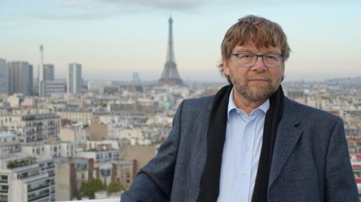
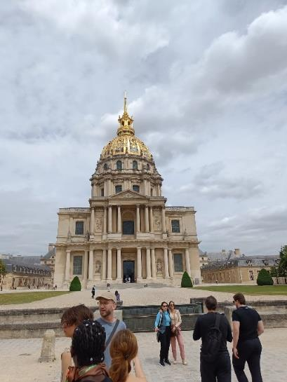
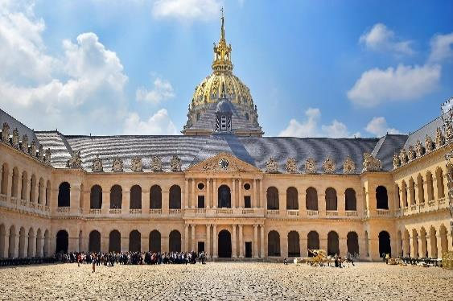
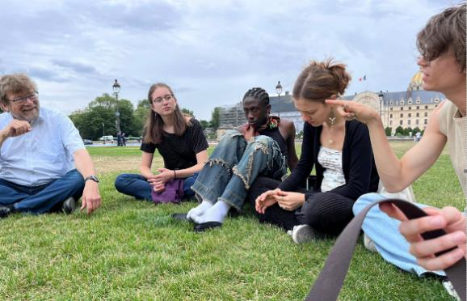
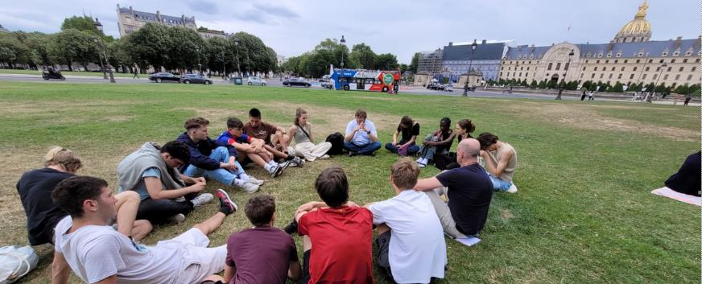

+++
title = "Mit Daniel Voll unterwegs im Hôtel des Invalides"
date = "2024-01-16"
draft = false
pinned = false
image = "image-001.jpg"
+++


Gespräch mit dem SRF-Korrespondenten über die Bedeutung des Hôtel des Invalides, über das Laizismusgesetz, welches Staat und Kirche trennte, und über die aktuelle Rentenreform.



Die Französische Revolution ist heutzutage fast jedem ein Begriff. Welche Folgen der Revolution und der Aufklärung im heutigen Paris immer noch erkennbar sind, ist eher weniger bekannt. Um herauszufinden, was aus den Werten der Aufklärung geworden ist, treffen wir uns mit dem SRF-Korrespondenten Daniel Voll zu einem aufschlussreichen Gespräch bei einem der geschichtsträchtigsten Gebäude von Paris.

Als wir, etwas verspätet, die Sicherheitskontrolle des Hôtel des Invalides passieren, wartet bereits ein sympathischer, eher kleiner, bärtiger Mann auf uns. Dieser stellt sich uns als Daniel Voll vor. Als SRF-Korrespondent in Paris ist er für die Berichterstattung der wichtigen Themen von ganz Frankreich verantwortlich.

Zu Beginn erfahren wir von ihm vieles über den historischen Ort, an dem wir uns befinden. Das Eindrücklichste ist, dass Napoleon angeblich in diesem grossen Kuppelbau begraben sei. Der Bau wirkt mächtig und eindrucksvoll. Wir verlassen den Eingangsbereich und begeben uns in den Innenhof.

Daniel Voll hat das Hôtel des Invalides als Treffpunkt vorgeschlagen, weil dieses Gebäude eine wichtige Bedeutung für unser Blockwochenthema habe. Wir befassen uns mit den Spuren der Aufklärung.

Auf dem Weg in den Innenhof erklärt uns Daniel Voll, dass das Hôtel des Invalides ursprünglich, unter der Herrschaft von König Ludwig XIV. im 17. Jahrhundert, als Spital und Altersheim für Kriegsveteranen errichtet worden sei. Es symbolisiere die königliche Hilfe für diejenigen, die ihr Leben im Dienste des Staates riskierten. Während der Epoche der Aufklärung im 18. Jahrhundert fanden zahlreiche Diskussionen über die Konzepte und Prinzipien dieser intellektuellen Bewegung auf politischer und gesellschaftlicher Ebene statt. Themen wie Vernunft, wissenschaftlicher Fortschritt, individuelle Freiheit und soziale Gerechtigkeit wurden intensiv diskutiert. «Das Hôtel des Invalides symbolisiert die Ideale der Aufklärung, weil der Fokus auf dem Wohl der Gesellschaft liegt und die Bedürfnisse jedes Einzelnen anerkannt werden. Heutzutage wird der Platz weitgehend für Gedenkfeiern verwendet», fügt der SRF-Korrespondent hinzu. 

> «Das Hôtel des Invalides symbolisiert die Ideale der Aufklärung, weil der Fokus auf dem Wohl der Gesellschaft lag und die Bedürfnisse jedes Einzelnen anerkannt wurden» 

Wir versammeln uns in einem Kreis, gleich neben altmodischen Kanonen, welche den eindrücklichen Innenhof ausschmücken. «Ebenfalls symbolisiert das Anwesen ein anderes Hauptziel der Aufklärung, die Trennung von Kirche und Staat. Dies wird Laizismus genannt», fährt Daniel Voll fort. Mit den Laizismusgesetzen im Jahr 1905 wollte die Republik den Einfluss der katholischen Kirche beschränken. Der Radiokorrespondent weist uns darauf hin, dass seither keine religiösen Zeichen in öffentlichen Gebäuden und Schulen mehr erlaubt seien. Das habe mit der Zeit zu Problemen zwischen Staat und katholischer Kirche geführt. 


Laizismus, auch Trennung von Kirche und Staat genannt, bedeutet, dass Religion und Staat getrennt sind. In einem laizistischen System beeinflusst die Religion nicht direkt die politischen Entscheidungen. Der Staat ist neutral gegenüber verschiedenen Glaubensrichtungen und behandelt alle Bürger gleich, unabhängig von ihrer Religion. Zum Beispiel können Schulen in laizistischen Ländern keine spezifische Religion unterrichten, sondern respektieren die Vielfalt der Überzeugungen. Dies soll sicherstellen, dass jede/r seine Religion ausüben kann.


Heutzutage drehe sich die politische Debatte mehr um den signifikanten Anstieg der muslimischen Bevölkerung in Frankreich. Auch hier habe der Staat eingegriffen. «Die Kopftücher wurden im Jahre 2004 verboten», sagt uns Daniel Voll. Viele Muslim*innen lebten heute in den Banlieues, wo es viele Spannungen gebe. «In den Banlieues von Paris wurde vor ein paar Tagen der 17-jährige Nahel von einem Polizisten erschossen und es kam zu grossen Ausschreitungen. Warum kommt es denn in Frankreich immer wieder zu Auseinandersetzungen?», fragen wir Daniel Voll. Er antwortet, dass es in Frankreich immer noch extreme soziale Ungleichheiten gebe. In Paris sei der Kontrast zwischen den Banlieues und der Stadt besonders gross. Weil die Preise in der Stadt immer weiter stiegen, würden die ärmeren Leute an den Stadtrand gedrängt. Die Konsequenz davon sei, dass dort die Kriminalitätsrate steige. «Aufgrund steigender Preise, zum Beispiel von Benzin, ist die Wut der ärmeren Bevölkerung so gross, dass sie demonstrieren müssen», fügt Daniel Voll hinzu. Wir entscheiden uns, den Standort zu wechseln, weil auf einmal viele laute Klassen im Innenhof sind und wir beinahe schreien müssen, um uns zu verständigen.

Auf dem Weg nach draussen können wir auf der rechten Seite frei herumlaufende Kaninchen

bestaunen. Der Weg zu einer grossen Wiese zwischen dem Hôtel des Invalides und der Seine führt an

Dutzenden Polizisten vorbei, welche das Invalides beschützen. Unsere Gespräche werden andauernd von Sirenen übertönt. Nach der Überquerung der Rue de Grenelle gelangen wir schliesslich auf eine friedliche Wiese, die sogenannte Esplanade des Invalides. Da es immer noch früher Nachmittag an einem Wochentag ist, hat es dort kaum andere Menschen. Auf der Wiese setzen wir uns in einem Kreis hin.

«Die Idee der Rentenreform ist, das Rentenalter von 62 auf 64 Jahre zu erhöhen und ein Punktesystem einzuführen. Wie genau funktioniert dieses Punktesystem?», fragen wir weiter. Daniel Voll erklärt uns, dass das Punktesystem bereits seit 2019 in Kraft sei und die aktuelle Rentenreform der zweite Anlauf der Regierung von Macron sei, das Rentensystem weiter zu reformieren. Das Rentensystem wurde damals in eine Alterssparkasse, welche mit der 2. Säule der Schweiz verglichen werden kann, umgewandelt. «Die grösste Änderung der jetzigen Rentenreform ist, dass die Beitragsjahre von 41 auf 43 erhöht werden. Das heisst, dass jede/r französische Bürger*in 43 Jahre arbeiten muss, um seine Rente zu erhalten», fährt er fort. «Weshalb stösst dies beim Volk auf grossen Widerstand?» Daniel Voll erwidert mit seiner ruhigen Stimme, dass die Erhöhung der Beitragsjahre für viele ein Problem sei. «Wisst ihr schon, in welchem Alter ihr zu arbeiten beginnen wollt?» Wir antworten, dass wir wohl ungefähr mit 25 Jahren richtig zu arbeiten beginnen würden, weil wir noch studieren, auf Reisen gehen wollten und ins Militär müssten. «Wenn ihr mit 25 Jahren zu arbeiten beginnen würdet und dann 43 Jahre arbeiten müsstet», rechnet uns Daniel Voll vor, «dann wärt ihr frühstens mit 68 Jahren in Pension»

> «Wenn ihr mit 25 Jahren zu arbeiten beginnen würdet und dann 43 Jahre arbeiten müsstet, dann wärt ihr frühstens mit 68 Jahren in Pension»

Als es zu regnen beginnt und sich das Interview dem Ende zuneigt, schlägt Daniel Voll vor, noch weitere Fragen in einem kleineren freiwilligen Kreis zu besprechen. Also gehen einige Schüler mit Herrn Schindele, Herrn Mettauer und Daniel Voll in ein kleines Café und sprechen zum Abschluss bei einer warmen Schokolade über den vielseitigen und aufregenden Alltag eines Radiokorrespondenten. 

Rückblickend hat uns am meisten beeindruckt, dass uns Daniel Voll während dem Gespräch erzählte, dass die gegenwärtige Situation in Paris dem Zeitalter der Aufklärung und der Vorrevolution gleiche. Die Zeit der Aufklärung hat immer noch eine grosse Bedeutung für Frankreich, unter anderem weil damals die kritische Betrachtung von religiösen Überzeugungen aufkam. Philosophen wie Voltaire betonten die Notwendigkeit von Religionsfreiheit und Toleranz. Dies führte später zum Laizismusgesetz, welches den Staat und die Kirche endgültig trennte.


Am 27. Juni 2023 stoppte eine Motorradpatrouille in Nanterre, Paris, den 17-jährigen Jugendlichen Nahel im Auto. Als er unerwartet losfuhr, hat ein Polizist aus nächster Nähe auf den Jungen geschossen und ihn damit getötet. Der Polizist wurde in Gewahrsam genommen, gegen ihn wird wegen Verdachts auf Totschlag ermittelt. Nach einem Trauermarsch für den Jugendlichen kam es zu Auseinandersetzungen zwischen Protestierenden und der Polizei in Nanterre. Die Situation eskalierte. Die Beamten wurden mit Molotow-Cocktails beworfen. Daraufhin zog die Polizei Spezialkräfte zusammen und nahm 19 Menschen fest.

In Marseille kam es zu Zusammenstössen zwischen Hunderten von Protestierenden und der Polizei. Geschäfte wurden geplündert, Tränengas von der Polizei eingesetzt. In ganz Frankreich wurde protestiert, darunter in Städten wie Lille, Lyon und Bordeaux. In Grenoble wurde sogar ein Bus angegriffen, und die Verkehrsbetriebe stellten darauf ihren Betrieb ein.

Landesweit waren 40.000 Polizisten im Einsatz. Im Großraum Paris und vielen anderen städtischen Agglomerationen fuhren keine Busse und Strassenbahnen mehr, in Clamart, acht Kilometer vom Pariser Zentrum entfernt, galt eine nächtliche Ausgangssperre bis am 3. Juli. im Großraum Paris waren etwa 5000 Polizisten im Dienst.
