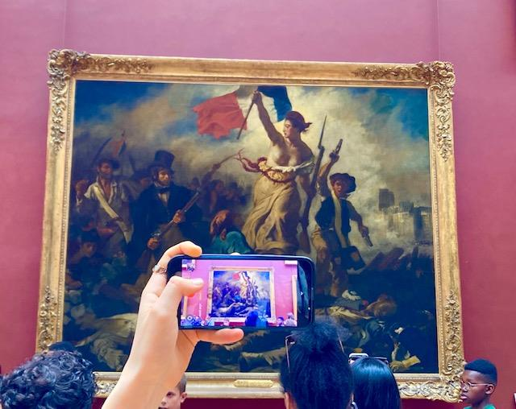

+++
title = "Musee Louvre Paris, La siècle des Lumières"
date = "2024-01-29"
draft = false
pinned = false
image = "image-000.jpg"
+++
Das Zeitalter der Aufklärung zwischen 1650 bis 1800 bezeichnet eine Zeit großen intellektuellen, kulturellen und philosophischen Wachstums in Europa, die die ganze Welt beeinflusse. In dieser Zeit begannen die Menschen, traditionelle Autoritäten wie die Kirche und Monarchie in Frage zu stellen und neue Ideen über Vernunft, Wissenschaft und individuelle Rechte anzunehmen. Die Ideen der Aufklärung prägten die moderne westliche Gesellschaft und beeinflussen bis heute unser Denken. Doch wie genau wurde die Kunst durch das Zeitalter der Aufklärung beeinflusst und wie entwickelte sie sich von da an weiter?

Der Mensch drückt sich seit jeher durch Kunst und Musik aus, und ihre Bedeutung wächst noch weiter. Während der Bewegung der Aufklärung zogen sich die Künstler von bereits existierenden Kunststilen wie Barock und Rokoko zurück und entschieden sich für neuere Stile wie Tenebrismus und Chiaroscuro. Der Louvre stellt die Werke zahlreicher Künstler aus dem Zeitalter der Aufklärung aus, deren Arbeiten die Werte der Bewegung widerspiegeln. Werte, die alte Bräuche und Traditionen in Frage stellen. Werte, die Glaubwürdigkeit in Frage stellen, Grenzen austesten und nach Antworten suchen. Sich zu befreien, sich gegen soziale Ungerechtigkeiten gegenüber den Menschen aufzulehnen und gleiche Rechte zu fordern. Auf diese Weise trug die Kunst dazu bei, die Ideen der Aufklärung einem breiteren Publikum zugänglich zu machen und die Kulturlandschaft Europas lebend zu halten.

Künstler verwendeten ihre Werke, um wichtige Ereignisse und Persönlichkeiten der Aufklärungszeit zu feiern. Sowie die Französische Revolution von Eugene Delacroix und den Philosophen Voltaire.

Die Revolution war eine Zeit großer sozialer Umwälzungen, die 1787 begann und 1799 endete. Das Volk wollte das Verhältnis zwischen den Herrschenden und den Beherrschten ändern und die alte Definition des Wesens der politischen Macht zerstören. Die ausgestellten Werke trug dazu bei, ein Gefühl der gemeinsamen kulturellen Identität zu schaffen und die Werte der Aufklärung zu fördern. Wie zum Beispiel in diesem Fall die Freiheit, was ein zentraler Wert der Aufklärung ist.

Ein weitere ist „Der Schwur der Horatier“ von Jacques-Louis. Auf dem Gemälde strecken drei Brüder ihre Arme nach den drei Schwertern aus, die ihr Vater hält. Die Männer sollen an der Stelle ihrer eigenen Nationen bis zum Tod kämpfen. Das Gemälde spiegelt die Bürgertugend, die Pflicht und den Gedanken wider, dass der Einzelne im besten Interesse der Gesellschaft handeln sollte.

Weitere Gemälde sind "Das Eingreifen der Sabinerinnen" wieder von Jacques-Louis David, "Das Floß der Medusa" von Théodore Géricault und "Das türkische Bad" von Jean-Auguste-Dominique Ingres. Diese Gemälde sind für das Zeitalter der Aufklärung relevant, weil sie die Ideen und Werte der damaligen Zeit widerspiegeln. So schildert "Der Tod des Sokrates" das Bekenntnis des Philosophen zu Wahrheit und Vernunft, "Der Schwur der Horatier" die Idee des Opfers für das Allgemeinwohl, die während der Aufklärung wichtige Werte waren und „Floss der Medusa“ die Kämpfe und Nöte veranschaulicht, mit denen die Überlebenden konfrontiert sind. Es kann mit aufklärerischen Themen des menschlichen Leidens und der Bedeutung von Empathie und Mitgefühl in Verbindung gebracht werden.

Für die Menschheit ist und bleibt die Kunst ein Werkzeug des Ausdrucks, aber auch der Erinnerung.

Obwohl die Ideen der Aufklärungszeit durch Kunst lebend gehalten sind, kann man trotzdem die Frage stellen, ob wir uns doch nicht als aufgeklärt verhalten. Zeigen sich die Werte ein aufgeklärter Mensch in unserer heutigen Gesellschaft? Gehen wir miteinander um wie Aufgeklärter? In Paris ist es mir aufgefallen, dass die Parisienner gegenüber den Touristen nicht gastfreundlich waren. Im Louvre haben wir erfahren, dass Massen von Menschen die Kunst nicht geschätzt haben, sondern geistlos und ziellos durch die Gestaltung gelaufen sind. Die meisten haben wahrscheinlich keine Idee, was hinter der Kunst steckt und ihr Bedeutung. 

Es ist eine große Schande, den Louvre zu besuchen, nur um ein Gemälde zu sehen, nämlich die Mona Lisa von Leonardo Da Vinci, und nicht die Gelegenheit zu nutzen, die Vielfalt des Museums zu erleben. Besonders beeindruckend fand ich die Galerie des griechischen Sonnengottes Apollo, eine Darstellung der Identifikation des Königs Louis XIV mit dem Gott Apollo. Um dieses Meisterwerk der architektonischen Dekoration zu schaffen, berief er die besten Maler, Vergolder und Bildhauer seiner Zeit, die später auch am Spiegelsaal des Schlosses von Versailles arbeiteten. Heute beherbergt die Galerie d'Apollon die königliche Sammlung von Hartsteingefäßen und die französischen Kronjuwelen.

Die obigen Bilder stammen aus der Galerie von Apollo. Von links nach rechts: die königliche Sammlung von Hartsteingefäßen, die Krone von Louis XV, Augustin Duflos Laurent Rondé und die Decke des Raumes, die die detaillierte architektonische Gestaltung zeigt.

Rückblickend war dieser Besuch im Louvre eine Erinnerung an die Bedeutung und Kraft der Kunst und aufschlussreich.