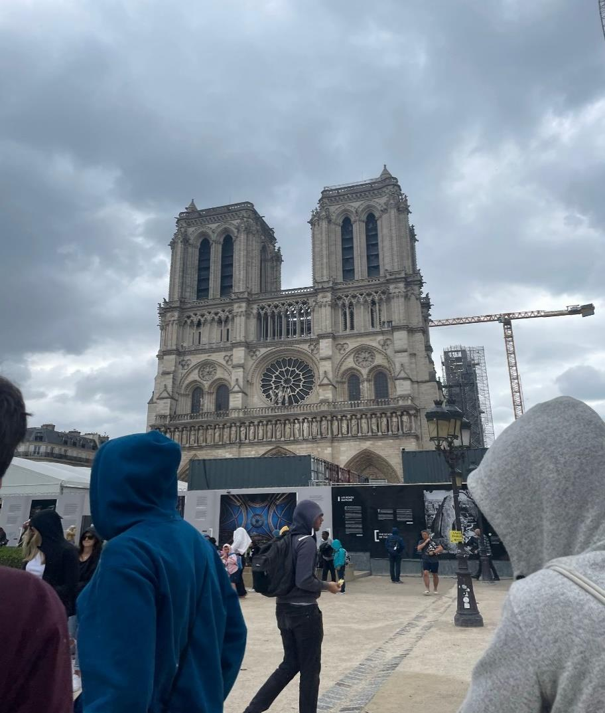

+++
title = "Reportage: Notre Dame"
date = "2024-03-05"
draft = false
pinned = false
image = "image-003.jpg"
+++
Es ist ausgesprochen heiss und man profitiert davon, seine Wasserflasche vor dem Verlassen des Hotels gefüllt zu haben. Auch das Warten auf die wenigen Mitschüler, die 5 Minuten nach der vereinbarten Zeit noch nicht da sind, hilft bei dieser Hitze nicht. Als Sitzgelegenheit wird der Sockel einer Statue verwendet. Das laute Geräusch, welches von der Stadt um uns herum ausgeht, scheint plötzlich lauter zu sein als zuvor. Im Laufe der Tage, welche man in Paris verbringt, gewöhnt man sich an den ständigen Lärm von Autos, Schritten und Gesprächen. Der freiliegende Vorplatz vor der Notre Dame de Paris scheint eine Art Akkumulation der üblichen städtischen Attribute wie Gestank, Lärm und Hitze zu sein. Eine gewisse Müssigkeit in der Gruppe ist nicht zu verleugnen, denn am Vorabend haben viele bis spät in die Nacht gefeiert. Viele, mittlerweile gelangweilte, Blicke wandern rüber zu der Kathedrale, welch hinter vielen weissen Bauarbeiter-Pavillons hervorragt. Sie ist tatsächlich ein Blickfänger. Sobald sie auch nur in Sichtweite ist, fällt sie einem direkt auf. Doch in der Mittagshitze scheint niemand ihre Schönheit zu bemerken. Unsere Führerin, eine ältere deutsche Dame, welche bereits seit ein paar Minuten still die Mittagshitze erträgt, beginnt schliesslich über die Gotik zu erzählen.

Die Gotik sei im Jahre 1140 im Norden Frankreichs entstanden. Sie folgte auf die Romanik. Ein Merkmal der Epoche sei der Baustil für Kirchen. Dies, obwohl Rathäuser auf gotische Art und Weise gebaut wurden. Diese architektonische Bewegung sei eng mit dem christlichen Glauben verbunden. Der Hauptzweck dabei sei, den Gläubigen Ehrfurcht einzuflößen und gleichzeitig die großartige Pracht des Göttlichen widerzuspiegeln. Die Notre Dame sei während des Übergangs zwischen Romantik und Gotik von Bischof Maurice de Sully und Ludwig VII. erbaut worden. Die Notre Dame verkörpere die gotischen Elemente mit ihren markanten Fassaden und Spitzbögen. Die Expertin weist auf die Westfassade hin, die mit biblischen Szenen markiert ist. Beispiel dafür ist die Nord- und die Süd-Rosette. Noch dazu besitze die Notre Dame eine vertikale Ausrichtung, die ein Gefühl von Erhabenheit und Transzendenz vermittle, indem sie die Gläubigen buchstäblich in den Himmel führten und zur Erinnerung zu den Göttliche dienten. Trotz einer tragischen Brandkatastrophe im Jahr 2019 gilt die Notre Dame als herausregendes Beispiel für die Verbindung von Glauben und Kreativität.

In der Mittagshitze wird uns über den großen Brand im Jahr 2019 erzählt. Die Notre Dame ist von vielen und grossen Baustellen umgeben. Es stellte sich heraus, dass es ein Feuer gab, welches das meiste vom Dach verbrannt und geschädigt hat. Laut der Expertin sei nur noch ein Drittel des Dachs nach dem Brand übrig gewesen. Die meisten Kunstwerke im Inneren des Gebäudes blieben vom Feuer verschont, aber wurden für die Renovationen und Reparierungen abgehängt. Die Expertin zeigt eine Minifigur von der Notre Dame, oder wie sie aussah, bevor die Flammen ausbrachen, damit wir sehen können, wie das Dach und der Turm an der Spitze vor dem Brand aussahen. Obwohl sie meinte, dass sie die Figur zufällig irgendwo gekauft hat, würde man annehmen, dass es mehr als ein zufälliger Kauf war. Dies liegt an ihrer Authentizität. Es fühlt sich hochwertig an, und jeder in der Klasse nimmt sich eine Weile Zeit, um es zu betrachten, bevor sie weitergegeben wird. Es verdeutlicht die Tragödie des Brandes im Jahr 2019, denn diese einst großartig aussehende gotische Kirche ist nun meistens von Baustellen bedeckt. 

Dies sei allerdings nicht das erste Mal gewesen, dass die Notre Dame grossen Schaden erlitten habe, sagt die Expertin. Während der Französischen Revolution wurde die Notre Dame Kathedrale geplündert und vandalisiert. Die Statuen von 28 Königen von Judäa an der Westfassade aus demJahre 1230 wurden von einem Mob, der sie für französische Könige hielt, abgerissen und auf dem Platz vor der Kathedrale enthauptet.

Die Notre Dame ist ein Zeuge einer längst vergangenen Epoche. Dass sie jedoch laut der Expertin im Laufe der Zeit einige Veränderungen erfahren habe, ist keine Überraschung. Zum Beispiel wurde im 18. Jahrhundert der Chor der Kathedrale vollständig renoviert und im Barockstil der damaligen Zeit dekoriert. Viele weitere Änderungen, die wegen einer Touristenfamilie nicht hörbar sind, wurden in dieser Zeit auch vorgenommen. Auf die Frage nach den Gründen antwortet die Expertin: «Die Mode ändert sich ständig, es ist ein nie endender Kreislauf. Was damals cool war, scheint jetzt altmodisch und hässlich zu wirken. Am Ende handelt es sich um ästhetische Gründe, nicht praktische.” Nach ihren Elaborationen über die Mode vergangener Zeiten, erzählt uns die Expertin über Napoleon Bonaparte. Man bemerkt, dass die ganze Klasse wieder Interesse hat, sobald der Name Napoleon fällt.


Napoleons Beziehung mit der Notre Dame war eine politische. Aufgrund eines Versuches, die katholische Kirche an seiner Seite zu haben, fand die Krönung in der Kathedrale statt. Er war ein Verfechter der Ideen, die von der Französischen Revolution gefördert wurden, wie Freiheit und Gleichheit. Napoleons Beziehung mit der katholischen Kirche war auch eine komplizierte, da er versuchte, eine Balance zwischen der Wahrung der Traditionen und der Verfestigung seiner eigenen Macht zu finden. Die Beziehung ist ebenfalls ein eindrückliches Beispiel der komplexen Verbindung, die zwischen der Französischen Revolution und der katholischen Kirche bestand. In den turbulenten Zeiten der Revolution geriet Notre Dame ins Fadenkreuz von Plünderungen und Strukturveränderungen, da die Kräfte der Revolution darauf abzielten, den Einfluss der religiösen Autorität zu schwächen und den Weg für die Errichtung einer laizistischen Gesellschaft zu ebnen.


Die Anführungen über Napoleon und seine Beziehung zur Notre Dame sind interessant, da sie von einer der profiliertesten politischen Persönlichkeiten aller Zeiten und ihrer Beziehung zur wohl berühmtesten Kirche der Welt handeln. Sie dienten ebenfalls als Beispiel dazu, wie historische Stätten und Symbole von politischen Führern genutzt werden können, um ihre Macht zu legitimieren und ihre Agenda zu fördern.

Obwohl die Kathedrale im 12. Jahrhundert gebaut wurde, wurde sie trotzdem stark von der Französischen Revolution beeinflusst; diese enge Verbindung mit der Französischen Revolution verleiht der Notre Dame eine historische Bedeutung. Dass die Notre Dame noch dazu ein Denkmal der Zeit der Gotik ist, macht die Geschichte umso reicher. Sie hat viele Änderungen durchgemacht. Dies, obwohl sie ein historisches Artefakt ist. Die vorgenommenen Änderungen waren nicht aus praktischen Gründen, sondern ästhetischen. Dies sei, weil sich die Mode, laut der Expertin, ständig ändert. Mit jeder Änderung der Mode habe sich auch die Notre Dame geändert. Auch in früheren Zeiten war sie von Bedeutung, wie die gute Beziehung zu Napoleon Bonaparte zu ihr beweist. Ein Beispiel wäre, dass Napoleon Bonaparte seine Krönung in der Notre Dame hielt. Anschließend erfuhr die Kathedrale eine Umgestaltung und wurde zum Tempel der Vernunft. Sie symbolisierte das Ziel der Französischen Revolution, den Einfluss des Christentums zu untergraben und eine Gesellschaft zu errichten, die von Vernunft und säkularen Prinzipien regiert wird. Die Notre Dame ist also nicht nur ein Denkmal für die reiche Geschichte Frankreichs, sondern auch ein Beispiel dafür, wie starke politische Bewegungen die Identität eines Landes und seine Vergangenheit verändern und prägen können.

Wir bedanken uns alle nun bei der Expertin, welche selbst möglichst bald Schatten sucht. Beim Weggehen nochmals einen letzten Blick auf die gewaltige Kathedrale zu werfen, lohnt sich alleweil. Die Hoffnung, sie wiederzusehen, würde für immer in einem bleiben.