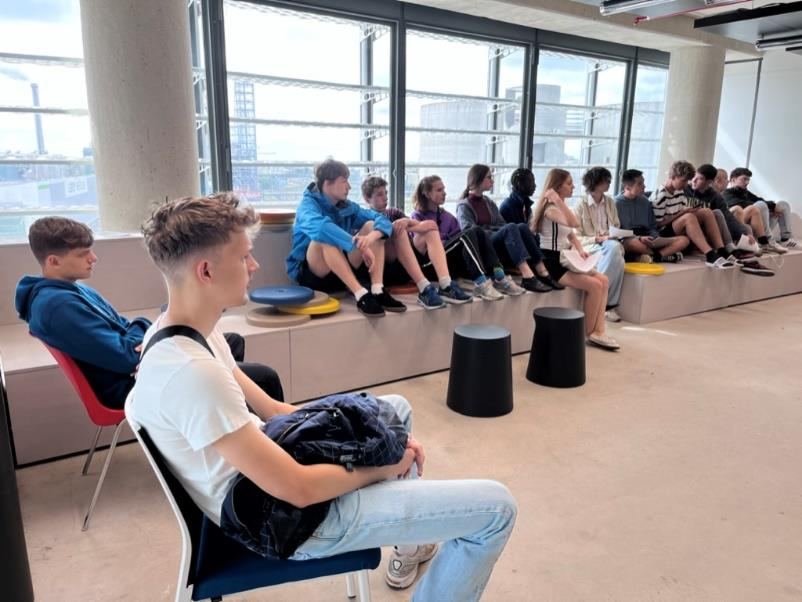
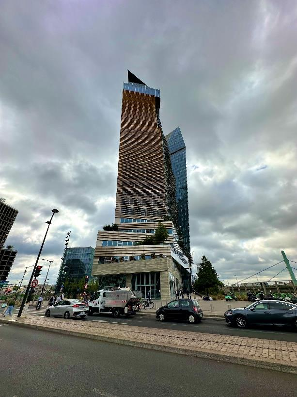
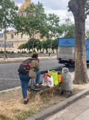
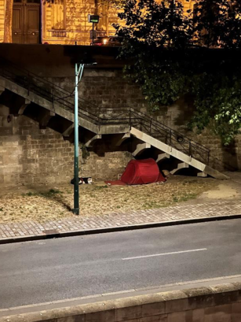

+++
title = "Samusocial de Paris — Ein Licht im Dunkeln"
date = "2024-03-01"
draft = false
pinned = false
image = "image-000.jpg"
+++


In Frankreich leben rund 330‘000 Obdachlose, davon 3500 in Paris. *Samusocial* bietet nicht nur Unterkünfte an, sondern geht auch direkt an die «Front» und spricht mit den Menschen, dokumentiert ihre Lage. Wie ist eine solche Organisation aufgebaut und wie operiert sie?



Der Hauptsitz des *Samusocial* befindet sich in einem neuen Glashochhaus in der Peripherie von Paris am Rand des 13. Arrondissements. Rundherum befinden sich Neubauten, ein paar haben hier sogar einen «einzigartigen» Stil. Der Umgebung und dem Gebäude nach würde man keine Sozialarbeit vermuten. Das Büro befindet in den oberen Stockwerken des Gebäudes, ganz unscheinbar. Ursprünglich wurde der Eingang der Halle A als Treffpunkt festgelegt, jedoch ist dieser leider unauffindbar, was für ein bisschen Verwirrung sorgt. Die abgemachte Zeit verstreicht und niemand erscheint. Nach einem kurzen Telefonat stellt sich heraus, dass wir auf der falschen Seite des Gebäudes eingetreten sind. Wir sollen trotzdem einfach mit dem Aufzug hochfahren. Links an der Wand befinden sich zwei kleine Aufzüge, gerade ausreichend für unsere kleine Gruppe. 

Der Aufzug erreicht die 7. Etage, in welchem sich das Hauptbüro des *Samusocial* befindet. Beim Öffnen der Türe des Aufzugs werden wir von Frau Corinne Taïeb begrüsst. Sie führt uns in den ersten Raum. Nach dem Eintreten wird man sofort von einem etwas hektischen Büroleben begrüsst. Frau Taïeb erklärt, die Menschen im ersten Raum seien vor allem für die Notrufnummer 115 verantwortlich. Mehrere Mitarbeiter sind gleichzeitig am Telefon. Alle tragen Headsets wie in einem Callcenter. Man hört dauernd Stimmen im Hintergrund. Vorne an der Wand hängen drei Bildschirme, die verschiedene Zahlen anzeigen, welche sich laufend aktualisieren. Es ist früher Vormittag, der Bildschirm zeigt schon über 90 Anrufe in der Warteschlange an. Es gebe verschiedene Kategorien, nach welchen die Anrufe sortiert würden, von denen die meisten eine Anfrage auf eine Unterkunft beinhalten. Es ist klar, dass dieser Raum nicht besonders geeignet ist für ein Gespräch. Frau Taïeb ruft deshalb schnell einen Kollegen, dieser öffnet eine Tür neben den Bildschirmen. Hinter dieser befindet sich ein grosser Meetingraum mit Ausblick auf die Stadt. Nach dem Eintreten wird die Tür geschlossen und die Stimmen im Nebenraum verstummen. Frau Taïeb und ihr Kollege stehen vorne vor einem grossen Bildschirm. Nun erfolgt eine Präsentation bezüglich der Tätigkeiten und Organisation von *Samusocial* de Paris. 



*Samusocial* betreibt die Notrufnummer 115, welche eine nationale Nummer ist, die von den Departements verwaltet wird. Die Nummer wird meistens rund um die Uhr, sieben Tagen die Woche besetzt, vor allem in grossen Städten wie Paris. *Samusocial* beantwortet über 2000 Anrufe pro Tag. Die Sozialarbeiter*innen bewerten die Bedürfnisse der Anrufer, informieren sie über die ihnen zur Verfügung stehenden Angebote und leiten sie entsprechend der Verfügbarkeit von Plätzen an Unterbringungsmöglichkeiten weiter. Die 115 in Paris nimmt auch Meldungen von Privatpersonen entgegen, die per Telefon, online oder über die App von* Samusocial *eingehen. Privatpersonen können Meldungen einreichen, wenn sie obdachlose Menschen auf der Strasse sehen, unabhängig davon, ob sie Hilfe zu benötigen scheinen oder nicht. In Verbindung mit der Koordination der* Maraudes *ist* Samusocial* auf den Strassen aktiv.



Obdachlosigkeit ist ein grosses Problem in Frankreich, sogar in der Hauptstadt Paris. Der Stiftung Abbé-Pierre nach befinden sich zurzeit rund 330'000 obdachlose Personen in Frankreich, 30'000 mehr als 2022. Als Vergleich: Die Stadt Bern hat ca. 135'000 Einwohner. Insgesamt sollen laut der Stiftung 4,15 Millionen Menschen in unzureichenden Wohnverhältnissen leben. Der breitere Begriff der Wohnungsnot, welche auch Situationen wie Energieunsicherheit oder unbezahlte Mietenrechnungen umfasst, betrifft nach Berechnungen der Stiftung 12,1 Millionen Menschen, das entspricht mehr als einem Sechstel der Bevölkerung (2021: ca. 67 Millionen.). Im Jahr 2022 gerieten einkommensschwache Haushalte aufgrund der beschleunigten Inflation zunehmend in Bedrängnis. In Paris selbst befindet sich über 3000 obdachlose Personen, darunter über 100 Minderjährige. Der Anteil der Familien beträgt 14%. Organisationen wie *Samusocial* sorgen für sichere und hygienische Übernachtungensmöglichkeiten für Menschen ohne Zuhause. Sie streben aber auch langfristige Lösungen an, um den Betroffenen ein Leben auf der Strasse zu ersparen.

Diese langfristigen Lösungen sind oft schwierig zu finden. So schwierig, dass es bisweilen «Jahre dauert, bis man eine langfristige Unterkunft für eine obdachlose Person gefunden hat», erklärt Frau Taïeb. Auch wenn einmal eine Unterbringung gefunden werde, sei es oft ein Ort ausserhalb von Paris. Die Menschen würden daher oft dieses Angebot ablehnen, weil sie aus unterschiedlichen Gründen nach Paris wollten. Jedoch gebe es auch nicht genug kurzfristige Unterkünfte. Obwohl schon über die Hälfte des Budgets für Unterkünfte verwendet werde, fehle immer noch Geld. Denn *Samusocial* dürfe nur Geld für Unterkünfte ausgeben, welche vom Staat bereitgestellt würden. Auf die Frage, ob der Staat schon genug tue, antwortet Frau Taïeb resolut: «Nein, denn sonst gäbe es ja keine Menschen, welche auf der Strasse leben würden.» Dennoch habe es viele Fortschritte gegeben. Als Frau Taïeb *Samusocial* im Jahr 2003 beigetreten sei, habe es nur rund 5'000 Schlafplätze und 4 Mitarbeiter der Notrufnummer 115 gegeben. Heute gebe es rund 250'000 Schlafplätze und 27 Mitarbeiter der Notrufnummer. Es genüge aber immer noch nicht. *Samusocial* tue jedoch sein Bestes mit den beschränkten Mitteln.

*Samusocial* de Paris wurde im Jahr 1993 von Xavier Emmanuelli gegründet. Die Organisation handelt nach den Werten der im Jahr 1948 verabschiedeten «Allgemeine Erklärung der Menschenrechte» von der UNO, deren Grundlagen auf die Französische Revolution und Aufklärung zurückzufolgen ist. Die Mitarbeiter kämpfen täglich gegen die Ausgrenzung von Einzelpersonen und Familien, die obdachlos sind, und helfen ihnen, indem sie ihre Situation einschätzen und ihnen dann eine vorübergehende Unterkunft, medizinische Versorgung, Begleitung oder eine Weiterleitung an ein auf ihre Situation zugeschnittenes Hilfssystem anbieten.

Es gibt allerdings Kontroversen rund um den Namen von *Samusocial*. Im Französischen bedeutete der Begriff «SAMU» ursprünglich "Service d'aide médicale urgente", auf Deutsch: medizinischer Notdienst. Das Akronym gilt offiziell als Wort. Aus diesem Grund gibt es in der französischen Sprache zwei Bedeutungen für das Wort «SAMU»: mobiler sozialer Notdienst und "ambulanter Notfalldienst" im Fall der Organisation *Samusocial*.

, welche der berühmten Sorbonne Universität gehört.")

Frau Taïeb erklärt in der Folge eine wichtige Funktion des *Samusocial* de Paris: Die *Maraudes*. Sie selbst sei für die Koordination der *Maraudes* verantwortlich. In Paris koordiniere das *Samusocial* de Paris allein die *Maraudes*, deren Gruppen sich jedoch von unterschiedlichen Hilfsorganisationen aus Paris zusammensetzten. Die *Maraudes* würden eine äusserst wichtige Rolle in der Bekämpfung der Obdachlosigkeit in Paris spielen. Sie hätten allerdings oft nicht eine einfache Aufgabe, nämlich würden sie zum Teil nicht freundlich von den Menschen empfangen. Manchmal wollten die Menschen einfach nicht reden, manchmal würden sie sogar gewalttätig werden. Viele obdachlose Personen würden sich vom Staat im Stich gelassen fühlen und empfänden deshalb Wut.



Die Koordination der vielen *Maraudes* in Paris ist eine Hauptaufgabe von *Samusocial*. In Paris gibt es über 100 *Maraudes*-Gruppen. Sie sind eine Art Strassenpatrouille und oft in der Nacht unterwegs. *Maraudes*-Gruppen bestehen meist aus drei bis vier Personen. Ihre Hauptaufgabe ist es, zu obdachlosen Menschen zu gehen, die nicht mehr nach Hilfe fragen, und ihnen Hilfsgüter zu überreichen. Manche Gruppen haben allerdings auch die Pflicht, mit Informationen, welche sie von anderen Organisationen oder über 115 erhalten, eine bestimmte Person oder Gruppe zu lokalisieren und ihnen gegebenenfalls Nothilfe zu leisten. Andere Gruppen sind auf direkte Interaktionen mit den obdachlosen Menschen spezialisiert, wobei in solchen Teams häufig eine Fachkraft aus dem psychologischen Bereich mitwirkt.



Nach der über einstündigen Präsentation haben wir sehr viel über die Situation der Obdachlosigkeit in Frankreich und Paris allgemein und *Samusocial* gelernt. Frau Taïeb bringt uns zu den Aufzügen, mit denen wir gekommen sind. Zwei Minuten später treten wir aus dem Gebäude. Rundherum ist alles sauber und neu, es glänzt sogar. An diesem Ort ist es schwierig zu glauben, dass die Obdachlosigkeit in Frankreich so ein grosses Problem ist.

Auf unserer Reise nach Paris waren wir auf der Spur der Aufklärung, deren Werte und der Frage inwiefern diese noch heute weiterlebten. Als Grossstadt gibt es in Paris eine beachtliche Zahl an hilfsbedürftigen Menschen. Nachdem wir die Möglichkeit hatten, uns die Lage auch persönlich anzuschauen, fragen wir uns, ob die humanistischen Werte wirklich umgesetzt wurden oder in Vergessenheit geraten sind. Fehlt es an Willen oder Ressourcen?