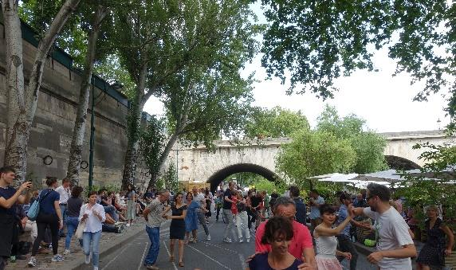

+++
title = "Paris: zwischen Blumenkaffees und Graffitiwänden  "
date = "2023-09-15"
draft = false
pinned = false
image = ""
+++


Eine Führung durch das revolutionäre Paris mit ihren Schattenseiten des Tourismus. Wir sehen die wichtigsten Monumente der Französischen Revolution, aber auch die Schattenseiten des übermässigen Tourismus.



Nur kurz nach unserer Ankunft in Paris holt uns unser Reiseführer Thibault vor unserem Hostel ab. Ein Stadtspaziergang mit dem Fokus Französische Revolution steht uns bevor. Der Reiseführer begrüsst uns auf Englisch. Wir stellen uns vor und fragen ihn, ob ihm die Arbeit mit Touristen und ihren verschiedenen Wünschen und Zeitplänen gefällt.

*Thibault holt aus: Wir arbeiten mit verschiedenen Unternehmen zusammen. Die Anpassung unseres Zeitplans an diese liegt in unserer Verantwortung. Die Unternehmen schlagen eine Tour vor, und wir können sie akzeptieren oder ablehnen. Sobald wir jedoch einer Tour zustimmen, müssen wir sicherstellen, dass wir pünktlich dort sind. Die Anforderungen hängen von den verschiedenen Unternehmen ab, einige haben Richtlinien, die man vorher lesen und lernen muss. Andere verlassen sich auf das persönliche Wissen.*

**Gibt es manchmal Probleme mit den Touristengruppen?**

*Ich habe zwei Arten von Schwierigkeiten mit Kunden. Die erste sind Menschen, die krank oder verletzt kommen, zum Beispiel ein gebrochener Knöchel, aber trotzdem die Tour machen möchten und so die Gruppe verlangsamen. Schwierig sind auch Menschen, die zu spät kommen oder nicht wissen, welche Führung sie gebucht haben.* 

Ob wir vollzählig seien, fragt Thibault, wir hätten in diesen 3,5 Stunden viel vor. So führt er uns nur wenige Gehminuten von unserem Hostel zu der Geburtsstätte der Französischen Revolution, der Place de la Bastille. Er erzählt uns, dass die Bastille früher die Stadttorburg im Osten von Paris gewesen sei. Später sei die Burg in ein Staatsgefängnis umfunktioniert worden. Am 14. Juli 1789 habe der Sturm auf die Bastille die Geburtsstunde der Französischen Revolution markiert. Er erläuterte, dass die Stürmung der Bastille mit dem Ziel erfolgt sei, die dort inhaftierten Gefangenen zu befreien. Dies sei als Protest gegen die willkürliche Herrschaft des Königs und als Reaktion auf die Entlassung des beliebten Finanzministers geschehen. Die Säule in der Mitte wirkt nun, wo wir uns ihr genähert haben, noch imposanter. Sie stehe seit 1840 auf dem ehemaligen Burgboden und solle an die drei glorreichen Tage der Julirevolution von 1830 erinnern. Der Genius der Freiheit throne auf der Spitze der Säule und diene als Erinnerung an jene bedeutsamen Tage der Revolution, werden wir von Thibault aufgeklärt. Während Thibault von der Bedeutung des Monumentes berichtet, können wir unsere Augen fast nicht von der Julisäule lösen. Erst als Thibault uns zum Aufbruch mahnt, gehen wir weiter.

Kurze Zeit später finden wir uns am Place des Vosges wieder. Der Platz mit seinem grossen Park wurde im Jahr 1800 so benannt. Der Name «Vosges» stammt vom Département Vosges (Region im Osten von Frankreich), das als erstes die damals eingeführte Revolutionssteuer vollständig beglichen hatte. Er ist einer der ältesten und schönsten Parks von Paris. Thibault führt uns zu der Statue in der Mitte des Parkes. Ein Mann auf einem Pferd. Es ist, wie die Inschrift im Stein vermerkt, Louis XIII. Nur kurz können wir die Statue bewundern, schon werden wir an den Rand des quadratischen Platzes geführt. Der Parkt wird von Häuser aus roten Backsteinen umringt. Im Haus Nr. 6, in der zweiten Etage hat der Schriftsteller Victor Hugo gewohnt. Die Mietpreise sind momentan sehr hoch, erzählt uns Thibault. Es ist eine gefragte Gegend. Die Arkaden unter den Häusern sind angenehm kühl. 

Wir laufen weiter durch das ehemalige jüdische Quartier. Das Quartier macht an diesem ersten Sonntag im Juli einen friedlichen und ausgelassenen Eindruck: Wir fühlen uns direkt willkommen. Die Cafés sind aufwendig verziert, meistens mit Blumenranken, die sich die Wände hochwinden und dies in den verschiedensten Farben. Mal rot, dann rosa und ein anderes Mal blau. Für uns wie auch für die meisten Touristen ist dies sehr anziehend. Nur durch diesen Blumenschmuck erhalte ein Café circa 25 Prozent mehr Besucher, verrät uns Thibault. Doch von einem jüdischen Viertel ist wenig zu merken. Dies rührt daher, dass während des Zweiten Weltkriegs vieles davon zerstört wurde, erklärt uns Thibault. Heutzutage sei das Quartier als ein Lesben- und Schwulenviertel bekannt.

Am Ufer der Seine begegnen wir ausgelassenen und fröhlichen Menschen. Es läuft Musik und in der Mitte tanzen Leute. Es ist ansteckend und am liebsten möchten wir mittanzen. Doch wegen unseres strammen Zeitplans müssen wir weiter. Nur wenige Meter dahinter merken wir: Die Stimmung trügt und ist nur vorübergehend. Ein paar Tage vor unserer Ankunft in Paris wurde Nahel Merzouk von der Polizei bei einer Autokontrolle angehalten und erschossen. Dies führte zu Unruhen und zu einer öffentlichen Diskussion über Rassismus und Gewalt bei der französischen Polizei. In den Banlieues fanden jeden Abend Demonstrationen statt. Auch wenn wir im Zentrum nicht wirklich etwas davon zu spüren bekommen, wird uns dies in dem Moment bewusst, als wir die Graffiti an einer Mauer am Ufer der Seine sehen.

Vor dem Gerichtsgebäude der Conciergerie auf der Île de la Cité angekommen, erzählt uns Thibault, dass dieses Gebäude früher etwa 2.780 Gefangene während der Französischen Revolution beherbergte. Wir sind fasziniert von der Pracht des alten Gefängnisses und Gerichtsgebäudes, in dem auch Marie-Antoinette untergebracht wurde. Von unserem Reiseführer erfahren wir, dass das alte Gerichtsgebäude immer noch für Prozesse verwendet werde. In diesem Moment fällt uns die grosse spanische Touristengruppe auf, die neben uns steht und die wie wir das Gebäude bewundert. Wir wenden uns dem Reiseführer zu:

**Wir haben heute schon sehr viele Touristen gesehen. So stellt sich uns die Frage, ob Paris gleich wie Venedig ein Tourismusproblem hat, das die Funktionalität des Alltags stört.**

*Es gibt zwei Schwierigkeiten, die Paris aufgrund des Tourismus hat. Zum einen die übermässige Nutzung des öffentlichen Verkehrs, zum andern der Mangel an bezahlbaren Wohnungen aufgrund von temporären Vermietungen an Touristen über Plattformen wie Airbnb. Der derzeitige Bürgermeister von Paris möchte solche temporären Vermietungen verbieten.* 

**Und was hältst du davon?**

*Obwohl ich es mir gewohnt bin, viele Touristen zu empfangen, empfinde ich ein solches Verbot als grossartige Politik. Denn es verhindert, dass Paris zu einem Traumland für Touristen und zu einer Museumsstadt wird.*

Unsere Neugier ein wenig befriedigt, setzten wir die Tour fort. Über den Pont des Arts geht es direkt zum Louvre. Als wir durch den Torbogen traten, werden wir von der Sonne geblendet. Erst nach einigen Sekunden ist es möglich, die Glaspyramiden zu bewundern. Und das zusammen mit Hunderten von anderen Touristen. «Wenn man jedes Gemälde und jede Statue im Louvre für 30 Sekunden anschauen würde, bräuchte man dafür 1,5 Jahre», erklärt uns Thibault. Und schon führt er uns weiter zu dem Jardin du Carrousel. Obwohl hier viele Touristen spazieren, herrscht eine größere Ruhe als vor dem Louvre. Wir schlendern in einem gemütlichen Tempo einmal quer durch den Garten. Beim Grand Bassin Rond bleiben wir kurz stehen und bewundern die im Wasser schwimmende Ente und ihre fünf Entlein. Am Ende des Gartens erwartet uns der Place de la Concorde.

Auf diesem Platz spürt man, nach Thibault, die Revolution am ausgeprägtsten. Die Place de la Concorde war vor drei Jahrhunderten die Grenze der Stadt und ein königlicher Platz, auf welchem in der Mitte eine Reiterstatue des Königs thronte. Der Platz war einem Sinnbild für die absolute Macht der Monarchie. Während der Französischen Revolution im Jahre 1793 wurde diese durch eine Freiheitsstatue ersetzt, und der Platz erhielt den neuen Namen Place de la Révolution. Auch wurde er zum Schauplatz für die öffentliche Hinrichtungen durch die Guillotine. Die Hinrichtung von König Ludwig XVI. und Königin Marie Antoinette war das Zeugnis für das Ende des Adels. Auch andere Revolutionäre wurden dort enthauptet, so als Beispiel Robespierre oder Danton: Die Revolution frass ihre eigenen Kinder. Mit dem Ende der Revolutionszeit erhielt der Platz seinen jetzigen Namen, Place de la Concorde. Heutzutage ist der Platz ein Symbol für die Wiedervereinigung des Staats mit dem Volk.  Der Obelisk aus dem 13. Jahrhundert wurde als Geschenk des ägyptischen Vizekönigs Muhammad Ali Pascha an Frankreich im Jahr 1836 auf dem Platz aufgestellt. Dies war eine Anerkennung für die Leistungen im Bereich der Hieroglyphenübersetzung durch den Forscher Jean-François Champollion. Heute erstrahlt der Obelisk nicht nur als Zeichen der Wertschätzung, sondern auch als die größte Sonnenuhr der Welt. 

Mit diesen erstaunlichen Informationen verlässt uns unser Reiseführer und wir machen uns auf den Weg zurück ins Hostel. Wir sehen die Spuren der Revolution und der Aufklärung in jeder Ecke. Sie haben sich nahtlos mit dem alltäglichen Leben vermischt, mit den vielen Einwohnern so wie auch mit den zahlreichen Touristen, die täglich die Stadt der Revolution besuchen. Paris zeigt schon wie zur Zeit der Aufklärung eine bemerkenswerte Anpassungsfähigkeit. Paris hat und wird sich noch oft mutig zusammen mit seinen Einwohnern in neue Revolutionen stürzen, die weltweite Auswirkungen haben. Paris ist in ständiger Bewegung und wir bewegten uns mit.



Während einer Verkehrskontrolle in Nanterre, einem Vorort von Paris, ereignete sich am 27. Juni 2023 eine tragische Begebenheit, bei der der 17-jährige Nahel Merzouk ums Leben kam, nachdem er von einem Polizeibeamten erschossen wurde. Zunächst gab die französische Polizei an, dass der Schuss in Notwehr abgefeuert worden sei. Diese Darstellung wurde jedoch durch ein in den sozialen Medien aufgetauchtes Video widerlegt. Die Veröffentlichung des Videos führte zu anhaltenden Protesten und gewaltsamen Unruhen, die sich während mehreren Tagen im Großraum Paris und in zahlreichen anderen Städten Frankreichs ausbreiteten.

